# Relationship Path: A Worked Example

```mermaid
flowchart LR
    BP["Business Problem"]:::problem --> I["Initiative"]:::problem
    I --> W["Workflow"]:::design
    W --> EP["Execution Plan"]:::build
    EP --> FR["Field Readiness"]:::build
    FR --> A["Adoption"]:::outcome
    A --> VR["Value Realization"]:::outcome

    classDef problem fill:#fde68a,stroke:#b45309,color:#78350f
    classDef design fill:#bfdbfe,stroke:#1d4ed8,color:#1e3a8a
    classDef build fill:#ddd6fe,stroke:#6d28d9,color:#4c1d95
    classDef outcome fill:#bbf7d0,stroke:#15803d,color:#14532d
```

A [Business Problem](./concepts/business-problem.md) is named by Business
→ scoped into an [Initiative](./concepts/initiative.md)
→ broken into one or more [Workflows](./concepts/workflow.md)
→ each Workflow gets an [Execution Plan](./concepts/execution-plan.md), typically owned by Technology/Data
→ the Execution Plan produces [Field Readiness](./concepts/field-readiness.md)
→ Field Readiness precedes [Adoption](./concepts/adoption.md), owned by Field leadership
→ Adoption is evaluated against the [Value Realization](./concepts/value-realization.md) target set by Business

## Where it breaks in practice

Written out as a chain, the failure mode is easy to see: if any single stage is skipped or silently merged with the next — most often, "the Execution Plan is complete" getting reported as "the initiative is done" — the initiative can look complete on a status report while producing zero measured value.

Concretely, this shows up as:

- A workflow that's live in the system but that field teams have quietly reverted to the old process for, because no one is tracking Adoption as distinct from go-live.
- - A "100% trained" status being read as Field Readiness being complete, when readiness also depends on local process support and field feedback being addressed — not just training attendance.
  - - Value Realization being reported at go-live, before Adoption has had time to hold or regress, producing a number that reflects enthusiasm rather than sustained behavior change.
   
    - ## See also
   
    - - [roles.md](./roles.md) for how ownership shifts at each arrow in the chain above, and why the handoff points are where this most often goes wrong.
      - 
